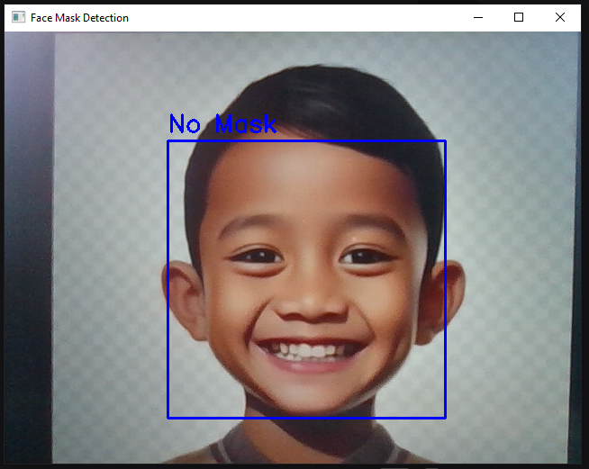
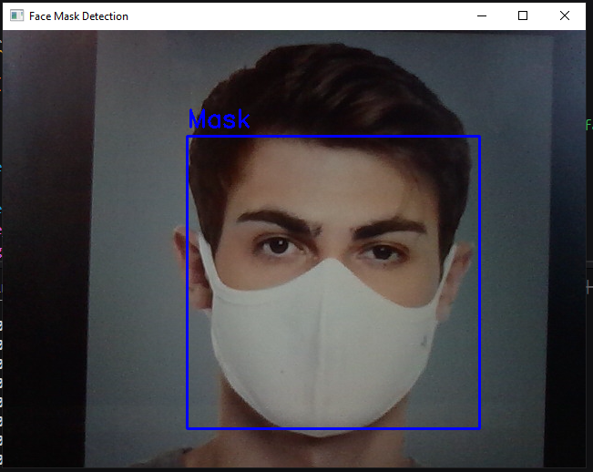

# Face Mask Detector

This project demonstrates a face mask detection system using TensorFlow and OpenCV (cv2). The system is designed to identify whether a person is wearing a mask or not in real-time through video input. It leverages a Convolutional Neural Network (CNN) to classify images of faces as either "Mask" or "No Mask."





## Features

- Real-time face mask detection using webcam.
- TensorFlow-based model for mask classification.
- OpenCV for image processing and real-time video capture. 

## Requirements

To run this project, you need to have the following dependencies installed:

- Python 3.x
- [TensorFlow](https://www.tensorflow.org/) (For the ML model)
- [Numpy](https://numpy.org/) (For array manipulations)
- [Cv2](https://docs.opencv.org/4.x/d6/d00/tutorial_py_root.html) (For capturing video)

## Installation

1. **Clone the Repository:**

   ```bash
   git clone https://github.com/ansariafzal-ka/Face-Mask-Detection.git
   cd Face-Mask-Detection
   ```

2. **Install Dependencies:**

   - Create the virtual environment:

     ```bash
     python -m venv venv
     ```

   - Activate the virtual environment:

     ```bash
     ./venv/Scripts/activate
     ```

   - You can install the required dependencies with:

     ```bash
     pip install -r requirements.txt
     ```

3. **Run the Application:**

   To start the application, run the following command in your terminal:

   ```bash
   py main.py
   ```
